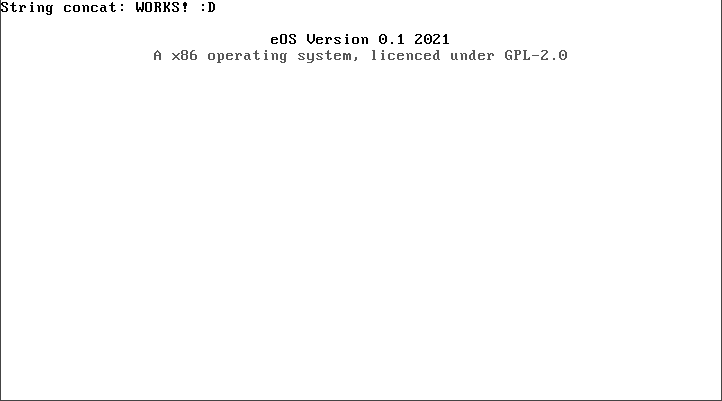

<h1 align="center">e-Operting System</h1>

A simple x86 operating system. Maybe 64bit in the future.

### Building & Running
Use the `Makefile` in order to build the binaries/objects et cetera- with <a href="https://linux.die.net/man/1/make" target="_blank">make</a>.
 
Example: `$ make os-image`
  
In order to run you can launch the OS with <a href="https://www.qemu.org/documentation/" target="_blank">qemu</a>. You can also launch qemu via make by doing: `$ make run`.

	$ make (option)
		run : Runs the OS with qemu
		drun : Recompiles the OS and runs it with qemu
		clean : Remove all object/binary/image files

### Features
 - 32bit
 - VGA
 - And more to come!

### Planned Features
Read `TODO.md` for planned features.

### Resources
#### Books
 - [Operating Systems: From 0 to 1](https://tuhdo.github.io/os01/) (Open-Source, unfinished)
 - [Writing a Simple Operating System - from Scratch](https://www.cs.bham.ac.uk/~exr/lectures/opsys/10_11/lectures/os-dev.pdf)
